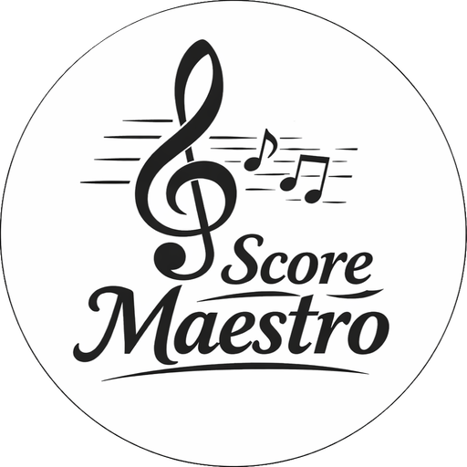

  

O **Ottavada** é um software gratuito para Windows 10 e 11 (Exe, `x32` e `x64`), Linux (AppImage, `x64`) e macOS (DMG universal, `x64` e `arm`), desenvolvido com Tauri e React. É um aplicativo desktop que facilita o dia a dia de pessoas que lidam com muitas músicas e partituras. Seu principal objetivo é resolver desafios comuns relacionados à localização, organização e movimentação entre computadores.

É importante destacar que o **Ottavada** não é uma ferramenta de criação, edição ou leitura de partituras. Ele atua como um intermediário e facilitador, integrando e organizando o seu fluxo de trabalho. Foi projetado para funcionar em conjunto com ferramentas amplamente utilizadas na criação e edição de partituras, como **Finale**, **MuseScore**, **Sibelius**, **Dorico** e **Encore**, além de outros programas compatíveis com formatos como **MusicXML**, **MIDI** e **PDF**.

# Como ele faz isso?

**Localização**: Filtros por categoria, compositor, arranjador e uma barra de pesquisa tornam rápida a busca por músicas. A lista exibe apenas o nome da música e, com um clique, expande para mostrar as partituras daquela música, seguindo a **ordem orquestral tradicional** (o padrão: [Standard Orchestral Score Order](./docs/Alto%20Nivel/4%20-%20Requisitos/1%20-%20Requisitos%20funcionais%20-%20ambos.md#62-instrumentos-suportados-e-a-ordem)), mantendo a tela limpa e sem poluição visual.

**Organização**: O sistema impede duplicação, não aceitando duas músicas com o mesmo nome, compositor e arranjador (ao menos um dos três deve ser diferente) e não permite instrumentos repetidos dentro de uma mesma música.

- Exemplo **corretos de músicas**: 
  
  - Nome da música, sem compositor e sem arranjador:
    - "Va pensieiro";
    - "Va pensieiro com coral".
  - Nome da música - compositor - arranjador:
    - "Serenata" - "Schubert" - "Ana";
    - "Serenata" - "Schubert" - "Carlos".

- Exemplo **corretos de instrumentos**:
  
  - "Trumpet" e "Trumpet (solo)";
  - "Trumpet 1" e "Trumpet 2".

**Movimentação entre computadores**: Envie músicas de um computador para o outro com um clique, com controle total do que vai e do que fica. Cada computador tem um [papel](./docs/Alto%20Nivel/1%20-%20Modo%20de%20uso.md) definido na configuração inicial.

**Backup automático**: O Ottavada gera backups periodicamente, assim, mesmo que seu computador seja perdido ou danificado, suas músicas e partituras permanecem seguras e podem ser restauradas em outro computador.

---

# Filosofia do sistema

O **Ottavada** adiciona músicas e partituras exclusivamente por meio de **indexação de pastas**. O processo é simples: basta selecionar uma pasta que contenha arquivos de partituras. A ferramenta lê esse conteúdo e o incorpora internamente (não alterando nada em seus arquivos). A partir daí, qualquer alteração feita nos arquivos dentro das pastas, como: adições, modificações ou exclusões, é automaticamente refletida no Ottavada.

Isso significa que a organização das músicas e partituras segue a estrutura de pastas definida por você. A ferramenta se adapta à sua forma de organização, e não o contrário, ideal para quem quer manter o controle sobre suas pastas e arquivos.

O Ottavada **não modifica suas pastas nem seus arquivos**, com uma exceção que é **mover para lixeira** música e/ou partitura, quando o usuário seleciona na ferramenta. Os nomes de músicas e partituras definidos no sistema são utilizados apenas internamente para organização e identificação, não afetando os nomes reais dos arquivos ou diretórios.

Se um dia você decidir deixar de usar o Ottavada, toda a suas pastas e arquivos permanecerá exatamente no mesmo lugar.

---

# Benefícios e Limitações do Ottavada

Além dos benefícios citados em [**Como ele faz isso?**](#como-ele-faz-isso), existem outros benefícios, mas também limitações, que são inerentes à arquitetura escolhida no desenvolvimento da ferramenta. Os benefícios são:

## Benefícios

### 1° Benefício - Você tem o controle TOTAL sobre suas pastas e arquivos

O Ottavada foi planejado para se "moldar" à forma como você trabalha, ou seja, seus arquivos continuam em seu controle e em sua organização. Com isso você não tem a dificuldade que outras ferramentas/serviços têm, que é o objetivo de dificultar sua saída ao máximo e fazer você se tornar um refém deles.

### 2° Benefício - Custo zero ou muito baixo

Utilizando o "provedor de nuvem" como ponte de comunicação e troca de arquivos entre os seus computadores com Ottavada, reduz a complexidade e o custo.

### 3° Benefício - Controle total do que vai para o(s) Ottavada(s) no modo Consultar

Como falado anteriormente, existem dois modos de usar o Ottavada. Com isso, você tem o controle total do que vai ou não para o modo Consultar.

### 4° Benefício - Backup

Além de ter um sistema de backup integrado, eles voltam EXATAMENTE para o mesmo lugar onde estavam no outro computador. Não precisando ter que aprender uma nova organização ou ficar procurando.

### 5° Benefício - Simples para que é de fora

Como o Ottavada segue um padrão simples, isso facilita DEMAIS para caso outra pessoa precise acessar seu repertório musical, porque ela não precisa aprender como você organiza suas pastas e arquivos, ela simplesmente precisa fazer uma pesquisa sem/com filtros, expandir a música e achar a partitura (que está ordenada).

### 6° Benefício - Funciona mesmo sem internet (com limitações)

A internet é indispensável para **enviar e receber atualizações** entre computadores, sem conexão essa etapa não é possível. Porém, o repertório **já baixado anteriormente** pelo Ottavada no modo **consultar** fica armazenado localmente no seu computador.

Isso significa que, mesmo estando **sem internet**, você ainda consegue **pesquisar, visualizar e abrir** todas as músicas e partituras que já foram baixadas antes.

**Resumo**: online você recebe o que há de novo; offline você continua usando tudo que já baixou.

### Complemento

Tem outros benefícios, como evitar duplicação (que facilita muito para você e outras pessoas), mas como já foi citado em textos acima, não irei repetir aqui.  

## Limitações

### 1° Limitação - Você precisa adicionar músicas manualmente

Quando você precisa adicionar nova(s) música(s) e partitura(s), você precisa ter o trabalho manual de ir ao explorador do seu sistema operacional e criar o diretório, nomeá-lo, mover as partituras para ele, nomeá-las, para indexar no Ottavada. 

Atualmente essa é uma limitação que não tem solução no Ottavada, mas a solução já está em **planejamento**.

### 2° Limitação - Problema se você precisar reorganizar as pastas

Caso você precise reorganizar suas pastas, quando indexa uma pasta, o Ottavada guarda o "endereço" dela. Se você mover a pasta de lugar e o endereço mudar, será necessário **reindexar a pasta** manualmente.

Atualmente essa é uma limitação que não tem solução no Ottavada, mas a solução já está em **planejamento**.

### 3° Limitação - Conflito no uso simultâneo entre computadores no modo Gerir

Não é recomendado utilizar ao mesmo tempo dois ou mais computadores no modo Gerir, devido a conflitos de escrita e reescrita no provedor de nuvem, isso é uma limitação da arquitetura.

Atualmente essa é uma limitação que não tem solução no Ottavada, mas a solução já está em **planejamento**.

### 4° Limitação - Aprender uma nova ferramenta

Existe também uma questão de custo/benefício: há **uma curva de aprendizado e adaptação**, você vai precisar entender como a ferramenta funciona e se acostumar com ela, o que leva um tempo. Mas, ao longo do tempo, você irá ter os benefícios citados anteriormente.

---

# Sobre a documentação

A documentação do projeto está em `docs/` e foi dividida em três seções:

- **Alto Nível** — visão geral do sistema: requisitos, funcionalidades, arquitetura.
- **Anotações** — diário de desenvolvimento e ideias.
- **Baixo Nível** — aspectos técnicos: ferramentas, modelagem, fluxos, decisões de implementação.

> Se esta é sua primeira vez lendo a documentação, comece pelo **Alto Nível** antes de ir para o **Baixo Nível**. Entenda o *porquê* antes do *como*. Também recomendo ler os arquivos segundo a ordem no nome das pastas e dos arquivos.
