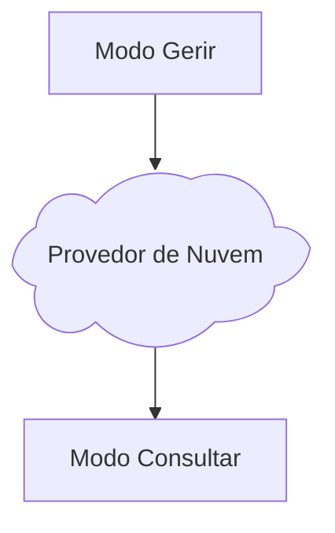

# Modo Gerir

O modo **Gerir** é responsável por adicionar, modificar e remover: música(s), partitura(s), categoria(s), compositor(es) e arranjador(es), além de **controlar o que vai ou não** para o Ottavada no modo **Consultar**. Ele é usado no computador que você usa no dia a dia para fazer seu trabalho de criar e modificar partituras, podendo ser usado em outros computadores, como: notebook de viagem e etc.

Você pode ter vários computadores com Ottavada neste modo, mas não é recomendado utilizá-los ao mesmo tempo (aplicativo aberto), devido ao envio de arquivos para o provedor de nuvem, podendo ocorrer sobrescrita ou perda de informações.

Ele necessita que você tenha todos os arquivos em seu computador para **indexar a pasta**.

Internamente no sistema é o tipo `server`.

# Modo Consultar

O modo **Consultar** é usado para **consultar e ler** o repertório adicionado ou modificado e autorizado (por meio dos `status`) pelo Ottavada no modo **Gerir**. Ele é usado no computador que você usa apenas para consultas, como por exemplo: computador de ensaio, onde você não quer que alguém faça uma alteração sem querer e use apenas para consulta ou tirar cópias.

Você pode ter vários computadores com Ottavada nesse modo e usando ao mesmo tempo, sem problema algum, já que ele apenas lê e nunca escreve nada.

Ele baixa e atualiza as música(s), partitura(s), categoria(s), compositor(es) e arranjador(es) mantendo os arquivos localmente para acesso mesmo offline.

Internamente no sistema é o tipo `client`.

# Fluxo Simplificado

