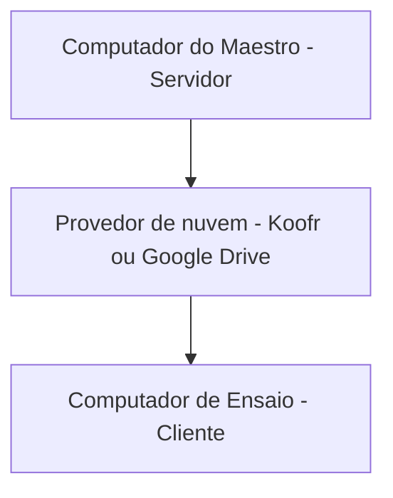

# Computador do Maestro - Servidor

É o computador principal do sistema e atua como a **fonte da verdade** do repertório, normalmente usado pelo maestro, regente ou responsável pela organização das partituras.

Nele é possível adicionar, editar e excluir músicas, partituras, categorias, compositores e arranjadores, além de gerenciar o status das músicas e partituras.

Internamente no sistema é o tipo `server`.

# Computador de Ensaio - Cliente

É o computador utilizado para consulta ao repertório, normalmente usado na sala de ensaio.

Ele baixa e atualiza as músicas e partituras com base no que o **Computador do Maestro** disponibiliza no **provedor de nuvem**, com status **Envio permitido** (`main` - internamente), mantendo os arquivos localmente para acesso offline.

Tendo permissão apenas para ler o repertório. Internamente no sistema é o tipo `client`.

# Fluxo

