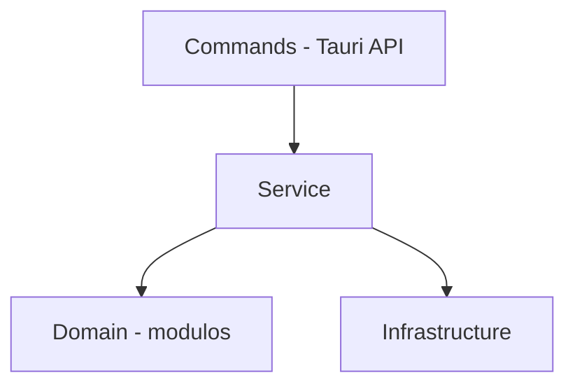

# Comunicação entre o Front e Back

A comunicação ocorre por meio de `invoke()` do **@tauri-apps/api/core**, com wrappers tipados em `api/commands.ts`.

# Front

## Diretórios e arquivos

### Pasta api/

Wrappers tipados para chamadas `invoke()` do Tauri, organizados por domínio.

**commands.ts** - Expõe funções assíncronas para Songs, Scores, Categories, Settings, Updates, Scan, Rclone e Backup.

---

### Pasta components/

Componentes React da interface gráfica.

**FirstRunPage.tsx** - Página de configuração inicial exibida no primeiro acesso.

**SettingsPage.tsx** - Página de configurações do aplicativo.

**SongsList.tsx** - Lista principal de músicas.

**Sidebar.tsx** - Barra lateral com categorias, compositores e arranjadores.

**TopBar.tsx** - Barra superior com busca e ações.

**StatusBar.tsx** - Barra de progresso inferior.

**SongRow.tsx** - Linha de música na listagem.

**ScoreRow.tsx** - Linha de partitura expandida.

**AddFilesModal.tsx** - Modal de adição e revisão de arquivos de partituras.

**ChangeComputerTypeModal.tsx** - Modal para alternar entre o modo Gerir e o modo Consultar.

**DeleteFileConfirmationModal.tsx** - Modal de confirmação para exclusão de arquivos.

**EditAuthorModal.tsx** - Modal de criação e edição de compositores e arranjadores.

**EditCategoryModal.tsx** - Modal de criação e edição de categorias.

**EditInstrumentModal.tsx** - Modal de edição de instrumento de partitura.

**EditMusicModal.tsx** - Modal de criação e edição de músicas.

**EditScoreModal.tsx** - Modal de criação e edição de partituras.

**ImportBackupModal.tsx** - Modal para importar um backup existente.

**OrganizationNameField.tsx** - Campo de nome da organização reutilizável em formulários.

**RcloneLicenseModal.tsx** - Modal de aceite de licença do rclone.

**RcloneProviderModal.tsx** - Modal de configuração do provedor rclone.

**ScanReportModal.tsx** - Modal com relatório detalhado do scan de arquivos.

**SupportContactsCard.tsx** - Cartão com contatos de suporte.

**UseAsBaseScoreModal.tsx** - Modal para usar partitura existente como base.

**UpdateModal.tsx** - Modal de progresso e status de atualização do app.

#### Subpasta ui/

**ui/index.ts** - Barrel file que reexporta todos os componentes da pasta ui/.

**ui/CategoryCheckboxList.tsx** - Lista de checkboxes para seleção de categorias.

**ui/ConfirmationModal.tsx** - Modal genérico de confirmação com título, mensagem e ações.

**ui/ContextMenu.tsx** - Menu de contexto (clique direito) para ações em músicas e partituras.

**ui/FormField.tsx** - Campo de formulário padronizado com label, input e erro.

**ui/Metronome.tsx** - Metrônomo visual e sonoro para referência de andamento.

**ui/metronome.css** - Estilos do componente Metronome.

**ui/Modal.tsx** - Componente base de modal com overlay, fechamento e animação.

---

### Pasta context/

Estado global via React Context + useReducer.

**AppContext.tsx** - Provider e hooks do contexto global.

**reducer.ts** - Reducer com estado e ações da aplicação.

**types.ts** - Tipos do contexto (State, Action).

**useAppBootstrap.ts** - Inicialização e carregamento de dados do backend.

**useAppCrudActions.ts** - Operações CRUD (adicionar, editar, excluir).

**useAppScanFlow.ts** - Fluxo de verificação e aplicação de alterações de arquivos.

**backupImportFlow.ts** - Fluxo de importação de backup.

**clientSyncFlow.ts** - Fluxo de sincronização do lado cliente.

---

### Pasta hooks/

Hooks customizados reutilizáveis.

**useConfirmation.ts** - Hook para modal de confirmação de ações.

**useRcloneTest.ts** - Hook para testar conexão com provedor rclone.

**useScrollLock.ts** - Hook para travar scroll durante modais abertos.

---

### Pasta types/

Definições de tipos TypeScript da aplicação.

**index.ts** - Tipos principais (SongListItem, Category, AppSettings, etc.).

---

### Pasta utils/

Funções utilitárias e lógicas auxiliares.

**addFilesReview.ts** - Lógica de revisão de arquivos adicionados.

**categoryDisplay.ts** - Exibição/rotulagem de categorias.

**categorySelection.ts** - Filtro e seleção por categoria.

**computer.ts** - Detecção do modo de uso (servidor/cliente).

**errors.ts** - Tratamento e normalização de erros.

**formatters.ts** - Formatação de data, tamanho de arquivo, etc.

**indexedFileReviewOrder.ts** - Ordenação de arquivos na tela de revisão.

**instrumentOrder.ts** - Ordem de instrumentos conforme padrão de orquestra.

**libraryDuplicates.ts** - Detecção de partituras duplicadas.

**nameFormat.ts** - Padronização de nomes de músicas em letras maiúsculas e de nomes de partituras.

**paths.ts** - Manipulação e normalização de caminhos de arquivo.

**preloadImages.ts** - Pré-carregamento de imagens de partituras.

**rcloneErrors.ts** - Interpretação de mensagens de erro do rclone.

**rcloneProgress.ts** - Parsing do progresso de operações rclone.

**rcloneProviderChange.ts** - Lógica de alteração do provedor rclone.

**scanReport.ts** - Geração e formatação do relatório de scan.

**scoreStatus.ts** - Lógica de status de partituras.

**sidebarView.ts** - Navegação e views da barra lateral.

**songOrder.ts** - Ordenação de músicas na listagem.

**songSearch.ts** - Busca de músicas por substrings.

**startupUpdate.ts** - Verificação de atualização na inicialização.

**updateBody.tsx** - Conteúdo/estrutura do corpo de atualização.

**updateLock.ts** - Bloqueio de ações durante instalação de update.

**window.ts** - Restauração e gerenciamento da janela.

---

### Raiz do src/

**App.tsx** - Componente raiz com rotas, update gate e loading screen.

**App.css** - Estilos globais da aplicação.

**index.css** - Reset CSS e classes utilitárias.

**main.tsx** - Entry point React (ReactDOM.createRoot).

---

## Rotas

```
/            → MainPage (SongsList + Sidebar + TopBar + StatusBar)
/settings    → SettingsPage
*            → FirstRunPage (quando isFirstRun === true)
```

## Estado global

O estado é gerenciado via **React Context + useReducer** no `AppContext.tsx`.

O `State` do reducer (`reducer.ts`) centraliza:

- Lista de músicas (`songs`)
- Categorias, configurações, sidebar view
- Estado de carregamento (`isLoading`, `isScanningFiles`)
- Progresso do scan (`scanProgress`) e relatório (`scanReport`)
- Progresso do rclone (`rcloneProgress`: bytes, porcentagem, velocidade, ETA)
- Status de operação (`operationStatus`: título, etapa atual/total)

As ações do reducer cobrem operações CRUD, scan, rclone e navegação.

---

# Back

## Diretórios e arquivos

### Pasta commands/

Handlers dos comandos Tauri. Boundary da API entre frontend e backend.

**mod.rs** - Módulo raiz, reexporta todos os submódulos de comandos.

**common.rs** - Funções auxiliares compartilhadas entre comandos.

**song_commands.rs** - Comandos de CRUD e operações de música.

**score_commands.rs** - Comandos de CRUD e operações de partitura.

**category_commands.rs** - Comandos de CRUD de categorias.

**settings_commands.rs** - Comandos de leitura e escrita de configurações.

**update_commands.rs** - Comandos de verificação e instalação de atualizações.

**scan_commands.rs** - Comandos de verificação e aplicação de alterações de arquivos.

**backup_commands.rs** - Comandos de geração de backup (archives, events, snapshot).

**rclone_commands.rs** - Comandos de sincronização via rclone (config, test, upload, download).

**scan_report.rs** - Geração e estruturação do relatório de scan de arquivos.

---

### Pasta domain/

Modelos de domínio e erros. Camada pura, sem dependência de infraestrutura.

**mod.rs** - Módulo raiz do domínio.

**models.rs** - Structs e enums: Song, Score, Category, AppSettings, ScoreStatus, ComputerType, RcloneProvider, DTOs.

**errors.rs** - Enum AppError com todos os erros da aplicação.

---

### Pasta infrastructure/

Acesso concreto a dados e sistema operacional.

**mod.rs** - Módulo raiz da infraestrutura.

**database.rs** - Conexão com SQLite, criação de tabelas e migrações.

**database_songs.rs** - Queries e operações SQL da tabela de músicas.

**database_scores.rs** - Queries e operações SQL da tabela de partituras.

**store.rs** - Leitura e escrita do tauri-plugin-store (configurações persistentes).

---

### Pasta services/

Lógica de negócio e orquestração. Depende de domain e infrastructure.

**mod.rs** - Módulo raiz dos serviços.

**background_scanner.rs** - Scan inicial de diretórios e monitoramento contínuo de arquivos.

**backup_draft_ignored_service.rs** - Upload de arquivos rascunho/ignorados para nuvem.

**backup_msgpack_service.rs** - Geração do arquivo backup.msgpack.zst (exportação do banco).

**backup_songs_service.rs** - Geração de arquivos {songId}.tar.zst por música.

**client_sync_service.rs** - Sincronização do lado cliente (download e aplicação de mudanças).

**cloud_paths.rs** - Gerenciamento e construção de paths no provedor de nuvem.

**events_service.rs** - Geração do arquivo events.msgpack.zst (alterações incrementais).

**indexer.rs** - Indexação de diretórios de partituras em arquivos.

**msgpack_zstd.rs** - Compressão e descompressão no formato msgpack+zstd.

**name_formatter.rs** - Formatação e validação de nomes de músicas e compositores.

**path_normalizer.rs** - Normalização de caminhos de arquivos do sistema.

**snapshot_service.rs** - Geração do arquivo snapshot.msgpack.zst (estado consolidado).

**telemetry_service.rs** - Envio periódico de dados de telemetria anonimizados.

---

### Raiz do src-tauri/src/

**main.rs** - Entry point do binário Tauri (chama lib::run).

**lib.rs** - Configuração do Tauri, setup inicial, registro de comandos.

**logger.rs** - Inicialização de logs em arquivo rotativo com retenção de 30 dias.

---

## Camadas e dependências



Domain NÃO depende de Infrastructure

- **commands/**: Funções `#[tauri::command]` registradas em `lib.rs`. Recebem chamadas do front, validam permissões e delegam para `services/`.
- **services/**: Orquestram a lógica de negócio usando `infrastructure/` e `domain/`.
- **infrastructure/**: Acesso concreto a SQLite e tauri-plugin-store.
- **domain/**: Modelos puros (`Song`, `Score`, `Category`, `AppSettings`, enums como `ScoreStatus`, `ComputerType`, `RcloneProvider`) e erros (`AppError`).
