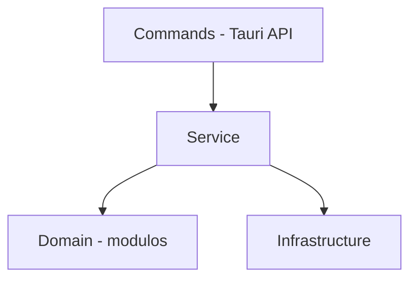

# Arquitetura do Front

## Estrutura de diretórios

```
src/
├── api/
│   └── commands.ts         # Wrappers tipados para invoke() do Tauri
├── components/
│   ├── ui/                 # Componentes de UI reutilizáveis (ConfirmationModal, etc.)
│   ├── FirstRunPage.tsx    # Página de configuração inicial
│   ├── SettingsPage.tsx    # Página de configurações
│   ├── SongsList.tsx       # Lista principal de músicas
│   ├── Sidebar.tsx         # Barra lateral (categorias, compositores, arranjadores)
│   ├── TopBar.tsx          # Barra superior (busca, ações)
│   ├── StatusBar.tsx       # Barra de progresso inferior
│   ├── SongRow.tsx         # Linha de música na listagem
│   ├── ScoreRow.tsx        # Linha de partitura expandida
│   └── Edit*Modal.tsx      # Modais de edição (música, partitura, categoria, autor, instrumento)
├── context/
│   ├── AppContext.tsx       # Contexto global (Provider + hooks)
│   ├── reducer.ts           # Reducer com estado global da aplicação
│   ├── types.ts             # Tipos do contexto
│   ├── useAppBootstrap.ts   # Inicialização (carregar dados do backend)
│   ├── useAppCrudActions.ts # Operações CRUD (adicionar, editar, excluir)
│   └── useAppScanFlow.ts    # Fluxo de verificação/aplicação de alterações
├── hooks/
│   ├── useConfirmation.ts   # Hook para modal de confirmação
│   ├── useRcloneTest.ts     # Hook para testar conexão rclone
│   └── useScrollLock.ts     # Hook para travar scroll durante modais
├── types/
│   └── index.ts             # Tipos TypeScript (SongListItem, Category, AppSettings, etc.)
├── utils/
│   ├── addFilesReview.ts    # Lógica de revisão de arquivos adicionados
│   ├── categorySelection.ts # Filtro por categoria
│   ├── computer.ts          # Detecção de tipo de computador
│   ├── formatters.ts        # Formatação de data, tamanho, etc.
│   ├── indexedFileReviewOrder.ts # Ordenação de arquivos na revisão
│   ├── instrumentOrder.ts   # Ordem de instrumentos (padrão orquestra)
│   ├── libraryDuplicates.ts  # Detecção de duplicatas
│   ├── nameFormat.ts        # Padronização de nomes (maiúsculo)
│   ├── paths.ts             # Manipulação de caminhos
│   ├── rcloneErrors.ts       # Interpretação de erros do rclone
│   ├── rcloneProgress.ts    # Parsing do progresso do rclone
│   ├── scanReport.ts        # Geração do relatório de scan
│   ├── scoreStatus.ts       # Lógica de status de partituras
│   ├── sidebarView.ts       # Navegação da barra lateral
│   ├── songOrder.ts         # Ordenação de músicas
│   ├── songSearch.ts        # Busca por substrings
│   ├── startupUpdate.ts     # Verificação de update na inicialização
│   ├── updateLock.ts        # Bloqueio de ações durante update
│   └── window.ts            # Restauração de janela
├── App.tsx                  # Componente raiz (rotas, update gate, loading screen)
├── App.css                  # Estilos globais
├── index.css                # Reset e utilitários
└── main.tsx                 # Entry point React
```

## Rotas

```
/            → MainPage (SongsList + Sidebar + TopBar + StatusBar)
/settings    → SettingsPage
*            → FirstRunPage (quando isFirstRun === true)
```

## Estado global

O estado é gerenciado via **React Context + useReducer** no `AppContext.tsx`.

O `State` do reducer (`reducer.ts`) centraliza:

- Lista de músicas (`songs`)
- Categorias, configurações, sidebar view
- Estado de carregamento (`isLoading`, `isScanningFiles`)
- Progresso do scan (`scanProgress`) e relatório (`scanReport`)
- Progresso do rclone (`rcloneProgress`: bytes, porcentagem, velocidade, ETA)
- Status de operação (`operationStatus`: título, etapa atual/total)

As ações do reducer cobrem operações CRUD, scan, rclone e navegação.

## Comunicação com o backend

Toda comunicação usa `invoke()` do **@tauri-apps/api/core**, com wrappers tipados em `api/commands.ts:1-565`.

O arquivo expõe funções assíncronas organizadas por domínio:

- **Songs**: listar, buscar, favoritar, indexar, importar, criar, editar, excluir
- **Scores**: listar, abrir, editar instrumento, alterar status, excluir, usar como base
- **Categories**: CRUD
- **Settings**: ler, salvar, first-run, toggle computer type, sair
- **Updates**: verificar e instalar
- **Scan**: preview de alterações, aplicar alterações, conexão com internet
- **Rclone**: configurar, testar, upload, download, sync, progresso
- **Backup**: gerar archives, events, snapshot, backup, importar/exportar

---

# Arquitetura do Back

## Estrutura de diretórios

```
src-tauri/src/
├── main.rs              # Entry point (chama lib::run)
├── lib.rs                # Configuração do Tauri, setup, registro de comandos
├── logger.rs             # Inicialização de logs (arquivo rotativo, 30 dias)
├── commands/             # Handlers dos comandos Tauri (API boundary)
│   ├── mod.rs
│   ├── common.rs         # Funções auxiliares compartilhadas
│   ├── song_commands.rs   # Comandos de música
│   ├── score_commands.rs  # Comandos de partitura
│   ├── category_commands.rs # Comandos de categoria
│   ├── settings_commands.rs # Comandos de configuração
│   ├── update_commands.rs # Comandos de atualização
│   ├── scan_commands.rs   # Comandos de verificação de arquivos
│   ├── backup_commands.rs # Comandos de backup
│   ├── rclone_commands.rs # Comandos de sincronização
│   └── scan_report.rs     # Geração de relatório de scan
├── domain/               # Modelos de domínio e erros (NÃO depende de infra)
│   ├── mod.rs
│   ├── models.rs          # Song, Score, Category, AppSettings, enums, DTOs
│   └── errors.rs          # AppError (enum de erros da aplicação)
├── infrastructure/       # Acesso a dados e sistema
│   ├── mod.rs
│   ├── database.rs        # Conexão e migrações SQLite
│   ├── database_songs.rs  # Queries de música
│   ├── database_scores.rs # Queries de partitura
│   └── store.rs           # Leitura/escrita do tauri-plugin-store
└── services/             # Lógica de negócio
    ├── mod.rs
    ├── background_scanner.rs       # Scan inicial e monitoramento de arquivos
    ├── backup_draft_ignored_service.rs # Upload de drafts/ignored para nuvem
    ├── backup_msgpack_service.rs   # Geração de backup.msgpack
    ├── backup_songs_service.rs     # Geração de {songId}.tar.zst
    ├── client_sync_service.rs      # Sincronização cliente (download e apply)
    ├── cloud_paths.rs              # Gerenciamento de paths na nuvem
    ├── events_service.rs           # Geração de events.msgpack
    ├── indexer.rs                  # Indexação de diretórios
    ├── msgpack_zstd.rs             # Compressão/descompressão msgpack+zst
    ├── name_formatter.rs           # Formatação e validação de nomes
    ├── path_normalizer.rs          # Normalização de caminhos
    ├── snapshot_service.rs         # Geração de snapshot.msgpack
    └── telemetry_service.rs        # Envio periódico de telemetria
```

## Camadas e dependências




Domain NÃO depende de Infrastructure

- **commands/**: Funções `#[tauri::command]` registradas em `lib.rs`. Recebem chamadas do front, validam permissões e delegam para `services/`.
- **services/**: Orquestram a lógica de negócio usando `infrastructure/` e `domain/`.
- **infrastructure/**: Acesso concreto a SQLite e tauri-plugin-store.
- **domain/**: Modelos puros (`Song`, `Score`, `Category`, `AppSettings`, enums como `ScoreStatus`, `ComputerType`, `RcloneProvider`) e erros (`AppError`).

## Comunicação com o front

O front chama funções Rust via `invoke("nome_do_comando", { args })`.

O Tauri faz a serialização JSON automática dos argumentos e retorno usando `serde`.

## Comunicação entre servidor e cliente

A comunicação entre computadores **não é direta**. O fluxo usa um provedor de nuvem como intermediário:

1. **Servidor** gera arquivos `.msgpack.zst` (events, snapshot) e `.tar.zst` (partituras) e envia para nuvem via rclone
2. **Cliente** baixa os arquivos da nuvem e aplica localmente

Formatos de arquivo na nuvem:

- `events.msgpack.zst` — Alterações incrementais
- `snapshot.msgpack.zst` — Estado consolidado do banco
- `{songId}.tar.zst` — Arquivos de partituras agrupados por música

## Banco de dados

SQLite embutido (via `rusqlite` com feature `bundled`).

Tabelas principais: `songs`, `scores`, `categories`, `song_categories`, `composers`, `arrangers`.

## Setup na inicialização

Ao abrir (`lib.rs:104-344`):

1. Inicializa logger (arquivos rotativos, 30 dias)
2. Cria diretórios de dados e rclone
3. Abre/conecta banco SQLite
4. Inicia telemetria (worker em thread separada)
5. Executa scan inicial em thread separada (apenas no servidor)
6. Registra ~70 comandos Tauri no `invoke_handler`
7. Restaura janela (se minimizada) e eleva prioridade do processo (Windows)
