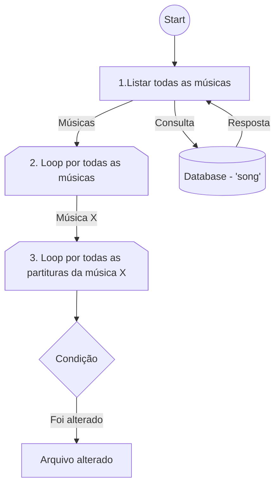
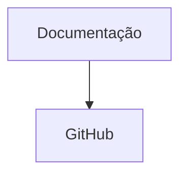
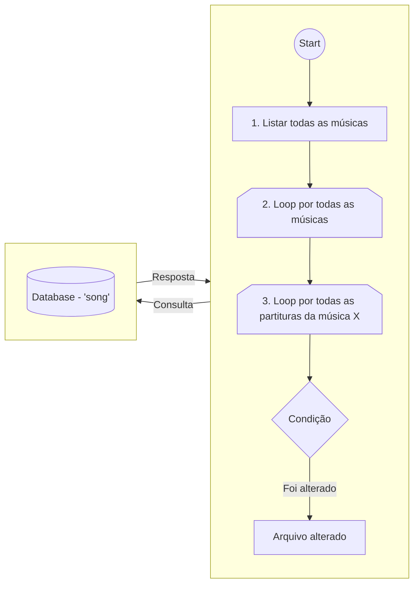
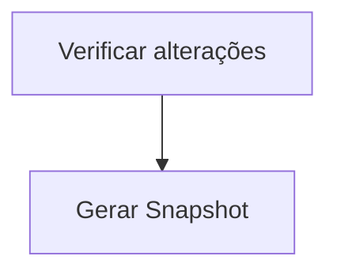

# 1. Verificar alterações dos arquivos

## Gerar Snapshot

teste

```mermaid
flowchart TD
A@{ shape: circle, label: "Start" }
A --> 1[1.Listar todas as músicas]
1 -->|Consulta| B@{ shape: cyl, label: "Database - 'song'" }
B -->|Resposta| 1
1 -->|Músicas| 2@{ shape: notch-pent, label: "2. Loop por todas as músicas" } 
2 -->|Música X| 3@{ shape: notch-pent, label: "3. Loop por todas as partituras da música X" } 
3 --> 4@{ shape: diamond, label: "Condição" }
4 -->|Foi alterado| 5[Arquivo alterado]
```

5. É feito a comparação do timestamp e tamanho do arquivo com que está no banco de dados.

```mermaid
flowchart TD
  A[Documentação] --> B[GitHub]
  click B "https://github.com" _blank
```

```mermaid
flowchart LR
    subgraph Esquerda[" "]
        direction TB
        A@{ shape: circle, label: "Start" } --> 1[1. Listar todas as músicas]
        1 --> 2@{ shape: notch-pent, label: "2. Loop por todas as músicas" }
        2 --> 3@{ shape: notch-pent, label: "3. Loop por todas as partituras da música X" }
        3 --> 4@{ shape: diamond, label: "Condição" }
        4 -->|Foi alterado| 5[Arquivo alterado]
    end

    subgraph Direita[" "]
        direction TB
        B@{ shape: cyl, label: "Database - 'song'" }
    end

    Esquerda -- "Consulta" --> Direita
    Direita -- "Resposta" --> Esquerda
```

```mermaid
flowchart TD
  A[Verificar alterações] --> B[Gerar Snapshot]
  click A "#verificar-alteracao-dos-arquivos" "Vai para a seção"
  click B href "#gerar-snapshot"
```