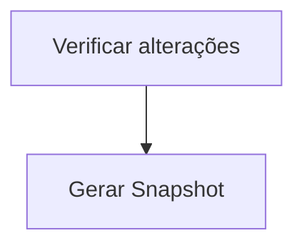

## Fluxo Principal

---

## Verificar alterações dos arquivos

Detalhamento do fluxo...

1. Lista todas as músicas
2. Compara timestamps...

---

## Gerar Snapshot

Detalhamento do fluxo...

1. Verifica se existe snapshot.zst
2. Cria snapshot.msgpack...
