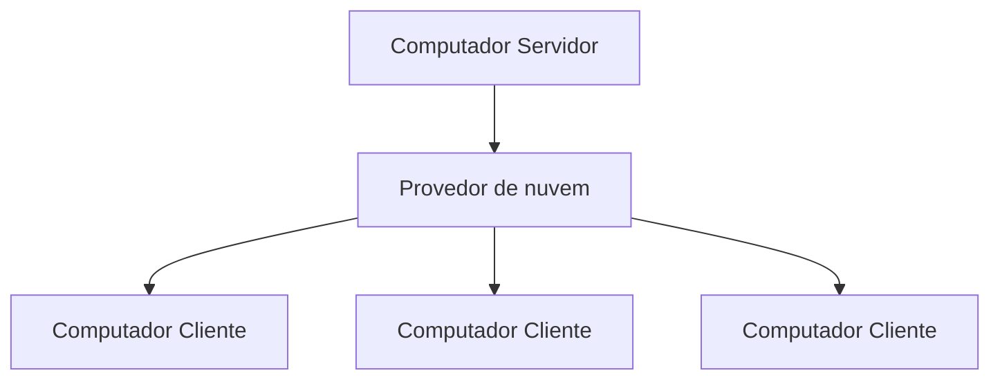

# 0. Porque o Score Maestro existe?

Faço parte de uma orquestra como flautista e, ao longo dos ensaios e apresentações, percebi diversas limitações no processo de distribuição de partituras, que era realizado por meio de pendrives. Além de ser um método trabalhoso, ele também estava sujeito a falhas simples, como o esquecimento do dispositivo pelo maestro ou esquecimento de passar a música para o pendrive.

Outro problema recorrente era a dificuldade de localizar a partitura correta. Muitas vezes existiam múltiplas versões da mesma música, o que tornava a organização confusa e aumentava o risco de utilizar arquivos incorretos. Ficou claro que não bastava apenas armazenar as partituras: era necessário também facilitar sua organização e localização.

Inicialmente, imaginei que o problema pudesse ser resolvido com uma ferramenta simples para envio de partituras. No entanto, ao analisar melhor a situação, percebi que o fluxo de trabalho era muito mais complexo. Uma partitura poderia estar em processo de revisão e ainda não estar pronta para distribuição. Permitir o compartilhamento de arquivos sem qualquer controle poderia criar novos problemas em vez de solucioná-los.

Durante esse processo, conversei diversas vezes com o maestro sobre essas dificuldades. Sua participação foi fundamental para o desenvolvimento da ideia, pois me ajudou a compreender como funciona, na prática, o ciclo de criação, revisão, aprovação e atualização das partituras. Embora esse fluxo fosse bem diferente do que eu imaginava inicialmente, depois de entendê-lo ele passou a fazer total sentido.

Foi a partir dessa combinação entre as necessidades observadas no dia a dia da orquestra e o entendimento do processo real de gerenciamento de partituras que surgiu o **Score Maestro**: uma ferramenta desenvolvida para tornar a distribuição, a organização e o controle de partituras mais simples, confiáveis e alinhados à realidade dos músicos e maestros.

# 1. Descrição do Projeto

O **Score Maestro** é um software gratuito, desenvolvido para facilitar o dia a dia de músicos e regentes no gerenciamento de músicas e partituras. Seu principal objetivo é resolver desafios comuns relacionados à organização, sincronização e distribuição de repertórios.

É importante destacar que o **Score Maestro** não é uma ferramenta de criação, edição ou leitura de partituras. Ele atua como um intermediário e facilitador, integrando e organizando o fluxo de trabalho já existente.

O sistema oferece suporte aos formatos `.pdf`, `.mus`, `.musx`, `.mscx`, `.xml`, `.musicxml`, `.sib`, `.enc`, `.mid` e `.midi`. Arquivos com extensões diferentes dessas são automaticamente ignorados durante o processo de indexação.

O **Score Maestro** foi projetado para funcionar em conjunto com ferramentas amplamente utilizadas na criação e edição de partituras, como **Finale**, **MuseScore**, **Sibelius** e **Encore**, além de outros programas compatíveis com formatos como **MusicXML**, **MIDI** e **PDF**.

Dessa forma, o sistema se adapta ao fluxo de trabalho já estabelecido, permitindo que músicos e regentes continuem utilizando as ferramentas que já conhecem e preferem, sem necessidade de mudanças na rotina de trabalho.

## 1.1. Repertório organizado

O **Score Maestro** oferece diversos filtros para facilitar a organização e a localização das músicas, incluindo:

- categoria;
- compositor;
- arranjador;
- ordenação de partituras seguindo o padrão da grade (de orquestra moderna);
- barra de pesquisa, para encontrar a música rapidamente.

## 1.2. Sem duplicação no repertório

Para manter a organização do repertório, o Score Maestro não permite nomes duplicados, tanto para músicas quanto para partituras de uma mesma música. Quando for necessário criar variações, os nomes devem ser ajustados para identificar claramente cada versão.

| **Errado**                                                                                                                    | **Correto**                                                                                                                              |
| ----------------------------------------------------------------------------------------------------------------------------- | ---------------------------------------------------------------------------------------------------------------------------------------- |
| **Música 1**: `Eis o Nosso Deus`<br/>**Música 2**: `Eis o Nosso Deus`                                                         | **Música 1**: `Eis o Nosso Deus`<br/>**Música 2**: `Eis o Nosso Deus (Com Coral)`                                                        |
| **Partitura 1**: `Violino I`<br/>**Partitura 2**: `Violino I`<br/>**Partitura 3**: `Trompete`<br/>**Partitura 4**: `Trompete` | **Partitura 1**: `Violino I`<br/>**Partitura 2**: `Violino I (Solo)`<br/>**Partitura 3**: `Trompete 1`<br/>**Partitura 4**: `Trompete 2` |

Dessa forma, cada música e cada partitura possuem uma identificação única, reduzindo ambiguidades e garantindo que o arquivo correto seja distribuído e acessado sem confusão.

## 1.3. Sincronização entre computadores

O **Score Maestro** utiliza uma arquitetura **cliente-servidor**, permitindo que múltiplos computadores mantenham suas músicas e partituras sincronizadas.

### 1.3.1. Computador servidor

O **computador servidor** é o computador principal, responsável pelo gerenciamento do repertório. Normalmente, é o computador utilizado pelo maestro, regente ou responsável pela organização das partituras.

Por meio dele é possível:

- Adicionar, modificar e remover músicas;
- Adicionar, modificar e remover partituras;
- Gerenciar categorias, compositores e arranjadores;
- Controlar quais músicas e partituras estarão disponíveis para os clientes por meio dos **status** definidos no sistema.

Todas as alterações realizadas no repertório são centralizadas neste computador.

### 1.3.2. Computador cliente

O **computador cliente** é utilizado para consultar e acessar o repertório sincronizado. Exemplos comuns incluem computadores da sala de ensaio, secretaria ou outros locais onde as partituras precisam estar disponíveis.

O cliente não realiza alterações no repertório. Sua função é:

- Baixar as alterações disponibilizadas pelo servidor;
- Manter uma cópia atualizada das músicas e partituras aprovadas;
- Permitir o acesso aos arquivos mesmo sem conexão com a internet.

Como os arquivos ficam armazenados localmente, as partituras continuam disponíveis normalmente após a sincronização.

**Observação:** para aplicar novas alterações ou receber, é necessário acesso à internet. Entretanto, as partituras já baixadas permanecem disponíveis normalmente.

### 1.3.3. Comunicação entre os computadores

Para oferecer mais segurança e simplicidade, o Score Maestro não realiza conexões diretas entre os computadores. O upload e download é feito de forma inteligente, enviando ou baixando apenas o que foi adicionando, alterado ou deletado. E para maximizar, é feito uma compactação dos arquivos, podendo usar até 50% menos de espaço, trazendo upload e download mais rápido e ocupa menos espaço.

A comunicação entre servidor e clientes ocorre por meio de um **provedor de nuvem**, como **Koofr** ou **Google Drive,** que atua como intermediário na sincronização dos dados.



# 2. Limitações e filosofia do sistema

## 2.1. Limitação

O **Score Maestro** adiciona músicas e partituras exclusivamente por meio de **indexação**. O processo é simples: basta selecionar um diretório que contenha arquivos de partituras. A ferramenta lê esse conteúdo e o incorpora internamente. A partir daí, qualquer alteração feita nos arquivos dentro desse diretório, como adições, modificações ou exclusões é automaticamente refletida no Score Maestro. Isso significa que a organização das músicas e partituras segue a estrutura de pastas definida por você. A ferramenta se adapta à sua forma de organização, e não o contrário.

Isso oferece mais independência e controle sobre os seus dados. Se um dia você decidir deixar de usar o Score Maestro, toda a sua estrutura de arquivos permanecerá exatamente como sempre esteve: organizada, acessível e familiar. Em outras palavras, o sistema trabalha sobre a organização já existente, sem impor formatos proprietários ou gerar dependências desnecessárias.

O Score Maestro **não modifica a estrutura de diretórios nem renomeia arquivos existentes**. Os nomes de músicas e partituras definidos no sistema são utilizados apenas internamente para organização e identificação, não afetando os nomes reais dos arquivos ou diretórios. A única operação que pode resultar em alteração direta no sistema de arquivos é a exclusão de músicas ou partituras, quando explicitamente solicitada pelo usuário.

## 2.2. Sugestão de nomes e instrumentos

O Score Maestro usa como base o **nome do diretório e do arquivo** para te sugerir no modal de revisão de adicionar música e partitura(s).

**Exemplo 1:**

```
Amazing Grace/
├── flute.mus
├── trumpet.mus
├── clarinet.mus
└── trombone.mus
```

**Exemplo 2:**

```
Amazing Grace/
├── Amazing Grace - flauta.mus
├── Amazing Grace - trompete.mus
├── Amazing Grace - clarinet.mus
└── Amazing Grace - trombone.mus
```

## 2.3. Windows

O **Score Maestro** foi desenvolvido e testado exclusivamente para Windows. Essa decisão foi tomada porque o público-alvo da aplicação, composto principalmente por músicos e outros usuários não técnicos, utiliza predominantemente esse sistema operacional.

Além disso, muitas das ferramentas utilizadas para leitura, edição e manipulação de partituras possuem melhor suporte, maior adoção ou são disponibilizadas prioritariamente para o ecossistema Windows, tornando essa plataforma a escolha mais adequada para o desenvolvimento inicial do projeto.
