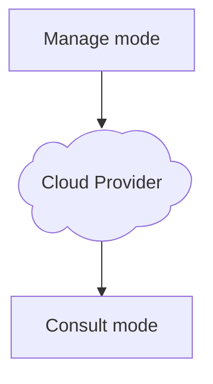

# Manage mode

The **Manage** mode is responsible for adding, modifying and removing: song(s), score(s), category(ies), composer(s) and arranger(s), as well as **controlling what goes or not** to the Ottavada in **Consult** mode. It is used on the computer you use day-to-day to do your work of creating and modifying scores, and can be used on other computers, such as a travel laptop and so on.

You can have several computers with Ottavada in this mode, but it is not recommended to use them at the same time (app open), due to sending files to the cloud provider, which could cause overwriting or loss of information.

It requires you to have all the files on your computer to **index the folder**.

Internally in the system it is the `server` type.

# Consult mode

The **Consult** mode is used to **consult and read** the repertoire added or modified and authorized (via the `status`) by the Ottavada in **Manage** mode. It is used on the computer you use only for consultation, such as: a rehearsal computer, where you don't want someone making an accidental change and it is only used for consultation or making copies.

You can have several computers with Ottavada in this mode and use them at the same time, without any problem, since it only reads and never writes anything.

It downloads and updates the song(s), score(s), category(ies), composer(s) and arranger(s), keeping the files locally for access even offline.

Internally in the system it is the `client` type.

# Simplified flow

