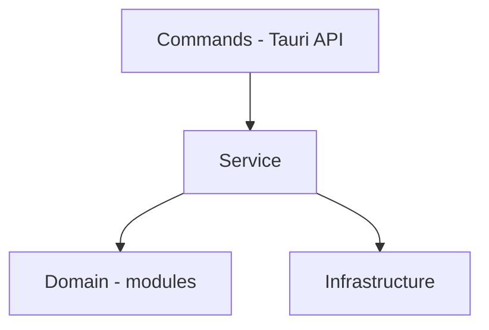

# Current architecture

This document describes the structure that exists in the repository. Planned or removed items must be recorded in the versions documentation, not as if they were active modules.

# Communication between Front and Back

Communication happens through `invoke()` from **@tauri-apps/api/core**, with typed wrappers in `api/commands.ts`.

# Front

## Directories and files

### api/ folder

Typed wrappers for Tauri `invoke()` calls, organized by domain.

**commands.ts** - Exposes asynchronous functions for songs, scores, categories, settings, updates, scan, rclone and backup.

---

### components/ folder

React components of the graphical interface.

**FirstRunPage.tsx** - Initial setup page shown on first access.

**SettingsPage.tsx** - Application settings page.

**SongsList.tsx** - Main list of songs.

**Sidebar.tsx** - Sidebar with categories, composers and arrangers.

**TopBar.tsx** - Top bar with search and actions.

**StatusBar.tsx** - Bottom progress bar.

**SongRow.tsx** - Song row in the listing.

**ScoreRow.tsx** - Expanded score row.

**AddFilesModal.tsx** - Modal for adding and reviewing score files.

**ChangeComputerTypeModal.tsx** - Modal for switching between Manage mode and Consult mode.

**DeleteFileConfirmationModal.tsx** - Confirmation modal for deleting files.

**EditAuthorModal.tsx** - Modal for creating and editing composers and arrangers.

**EditCategoryModal.tsx** - Modal for creating and editing categories.

**EditInstrumentModal.tsx** - Modal for editing a score's instrument.

**EditMusicModal.tsx** - Modal for creating and editing songs.

**EditScoreModal.tsx** - Modal for creating and editing scores.

**ImportBackupModal.tsx** - Modal for importing an existing backup.

**OrganizationNameField.tsx** - Reusable organization name field for forms.

**RcloneLicenseModal.tsx** - Modal for accepting the rclone license.

**RcloneProviderModal.tsx** - Modal for configuring the rclone provider.

**ScanReportModal.tsx** - Modal with a detailed file scan report.

**SupportContactsCard.tsx** - Card with support contacts.

**UseAsBaseScoreModal.tsx** - Modal for using an existing score as a base.

**UpdateModal.tsx** - Modal with the app update progress and status.

#### components/ui/ subfolder

**components/ui/index.ts** - Barrel file that re-exports the reusable components from the `components/ui/` folder.

**components/ui/CategoryCheckboxList.tsx** - List of checkboxes for category selection.

**components/ui/ConfirmationModal.tsx** - Generic confirmation modal with title, message and actions.

**components/ui/ContextMenu.tsx** - Context menu for actions on songs and scores.

**components/ui/FormField.tsx** - Standardized form field with label, input and error.

**components/ui/Metronome.tsx** - Visual and sound metronome for tempo reference.

**components/ui/metronome.css** - Styles of the Metronome component.

**components/ui/Modal.tsx** - Base modal component with overlay, closing and animation.

---

### context/ folder

Global state via React Context + useReducer.

**AppContext.tsx** - Provider and hooks of the global context.

**reducer.ts** - Reducer with the application state and actions.

**types.ts** - Context types (State, Action).

**useAppBootstrap.ts** - Initialization and data loading from the backend.

**useAppCrudActions.ts** - CRUD operations (add, edit, delete).

**useAppScanFlow.ts** - Flow for checking and applying file changes.

**backupImportFlow.ts** - Backup import flow.

**clientSyncFlow.ts** - Client-side synchronization flow.

---

### hooks/ folder

Reusable custom hooks.

**useConfirmation.ts** - Hook for the action confirmation modal.

**useRcloneTest.ts** - Hook to test the connection with the rclone provider.

**useScrollLock.ts** - Hook to lock scrolling while modals are open.

---

### types/ folder

TypeScript type definitions of the application.

**index.ts** - Main types (SongListItem, Category, AppSettings, etc.).

---

### utils/ folder

Utility functions and auxiliary logic.

**addFilesReview.ts** - Review logic for added files.

**categoryDisplay.ts** - Category display/labeling.

**categorySelection.ts** - Filtering and selection by category.

**computer.ts** - Detection of the usage mode (server/client).

**errors.ts** - Error handling and normalization.

**formatters.ts** - Date, file size formatting, etc.

**indexedFileReviewOrder.ts** - File ordering in the review screen.

**instrumentOrder.ts** - Instrument order according to the orchestra standard.

**libraryDuplicates.ts** - Duplicate score detection.

**nameFormat.ts** - Standardization of song names in uppercase and score names.

**paths.ts** - File path handling and normalization.

**preloadImages.ts** - Score image preloading.

**rcloneErrors.ts** - Interpretation of rclone error messages.

**rcloneProgress.ts** - Parsing of rclone operation progress.

**rcloneProviderChange.ts** - Logic for changing the rclone provider.

**scanReport.ts** - Generation and formatting of the scan report.

**scoreStatus.ts** - Score status logic.

**sidebarView.ts** - Sidebar navigation and views.

**songOrder.ts** - Song ordering in the listing.

**songSearch.ts** - Song search by substrings.

**startupUpdate.ts** - Update checking on startup.

**updateBody.tsx** - Update body content/structure.

**updateLock.ts** - Blocking of actions during update installation.

**window.ts** - Window restoration and management.

---

### src/ root

**App.tsx** - Root component with routes, update gate and loading screen.

**App.css** - Global application styles.

**index.css** - CSS reset and utility classes.

**main.tsx** - React entry point (ReactDOM.createRoot).

---

## Routes and screens

```
/            → main screen (SongsList + Sidebar + TopBar + StatusBar)
/settings    → SettingsPage
*            → FirstRunPage (when isFirstRun === true)
```

## Global state

The state is managed via **React Context + useReducer** in `AppContext.tsx`.

The reducer `State` (`reducer.ts`) centralizes:

- Song list (`songs`)
- Categories, settings, sidebar view
- Loading state (`isLoading`, `isScanningFiles`)
- Scan progress (`scanProgress`) and report (`scanReport`)
- rclone progress (`rcloneProgress`: bytes, percentage, speed, ETA)
- Operation status (`operationStatus`: title, current/total step)

The reducer actions cover CRUD operations, scan, rclone and navigation.

---

# Back

## Directories and files

### commands/ folder

Tauri command handlers. Boundary of the API between frontend and backend.

**mod.rs** - Root module, re-exports all command submodules.

**common.rs** - Helper functions shared between commands.

**song_commands.rs** - Song CRUD and operation commands.

**score_commands.rs** - Score CRUD and operation commands.

**category_commands.rs** - Category CRUD commands.

**settings_commands.rs** - Settings read and write commands.

**update_commands.rs** - Update checking and installation commands.

**scan_commands.rs** - File change checking and application commands.

**backup_commands.rs** - Backup generation commands (archives, events, snapshot).

**rclone_commands.rs** - rclone synchronization commands (config, test, upload, download).

**scan_report.rs** - Generation and structuring of the file scan report.

---

### domain/ folder

Domain models and errors. Pure layer, with no infrastructure dependency.

**mod.rs** - Root module of the domain.

**models.rs** - Structs and enums: Song, Score, Category, AppSettings, ScoreStatus, ComputerType, RcloneProvider, DTOs.

**errors.rs** - `AppError` enum with all application errors.

---

### infrastructure/ folder

Concrete access to data and the operating system.

**mod.rs** - Root module of the infrastructure.

**database.rs** - SQLite connection, table creation and migrations.

**database_songs.rs** - SQL queries and operations for the songs table.

**database_scores.rs** - SQL queries and operations for the scores table.

**store.rs** - Reading and writing of the persistent settings file (`app-store.json`) via `SystemStore`.

---

### services/ folder

Business logic and orchestration. Depends on domain and infrastructure.

**mod.rs** - Root module of the services.

**background_scanner.rs** - Initial directory scan and continuous file monitoring.

**backup_draft_ignored_service.rs** - Upload of draft/ignored files to the cloud.

**backup_msgpack_service.rs** - Generation of the backup.msgpack.zst file (database export).

**backup_songs_service.rs** - Generation of {songId}.tar.zst files per song.

**client_sync_service.rs** - Client-side synchronization (download and application of changes).

**cloud_paths.rs** - Management and construction of paths in the cloud provider.

**events_service.rs** - Generation of the events.msgpack.zst file (incremental changes).

**indexer.rs** - Indexing of score directories into files.

**msgpack_zstd.rs** - Compression and decompression in msgpack+zstd format.

**name_formatter.rs** - Formatting and validation of song and composer names.

**path_normalizer.rs** - Normalization of system file paths.

**snapshot_service.rs** - Generation of the snapshot.msgpack.zst file (consolidated state).

**telemetry_service.rs** - Periodic sending of telemetry data.

---

### src-tauri/src/ root

**main.rs** - Entry point of the Tauri binary (calls lib::run).

**lib.rs** - Tauri configuration, initial setup, command registration.

**logger.rs** - Initialization of rotating file logs with 30-day retention.

---

## Layers and dependencies



Domain does NOT depend on Infrastructure

- **commands/**: Functions `#[tauri::command]` registered in `lib.rs`. They receive calls from the front, validate permissions and delegate to `services/`.
- **services/**: Orchestrate the business logic using `infrastructure/` and `domain/`.
- **infrastructure/**: Concrete access to SQLite and the persistent settings file (`SystemStore`).
- **domain/**: Pure models (`Song`, `Score`, `Category`, `AppSettings`, enums like `ScoreStatus`, `ComputerType`, `RcloneProvider`) and errors (`AppError`).
